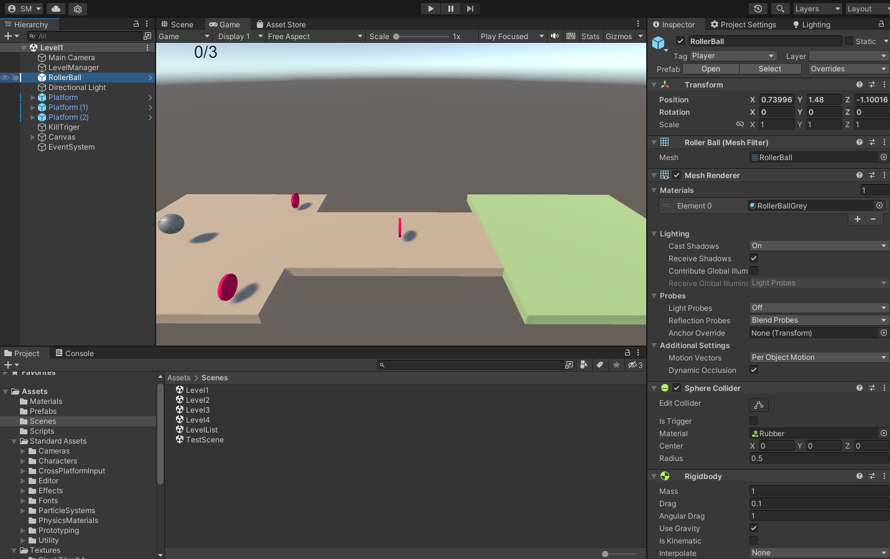
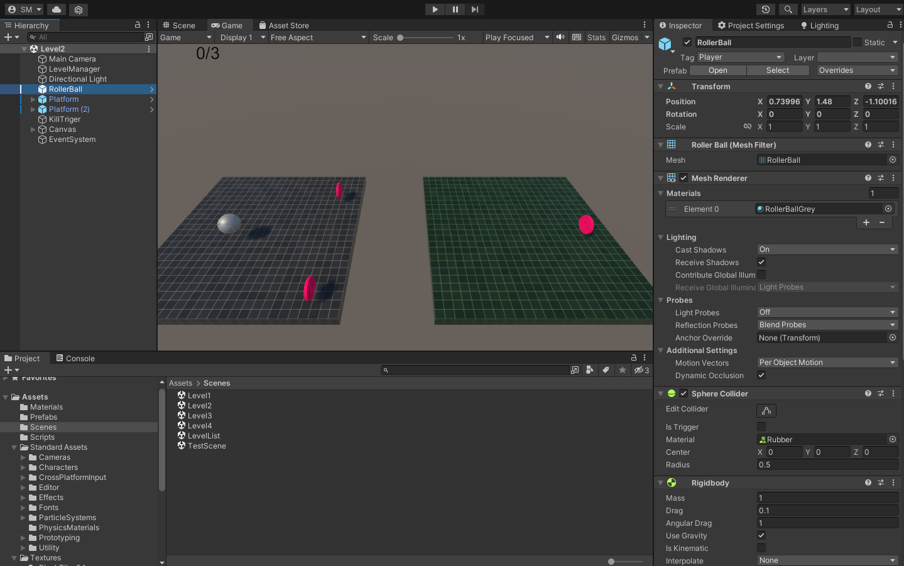
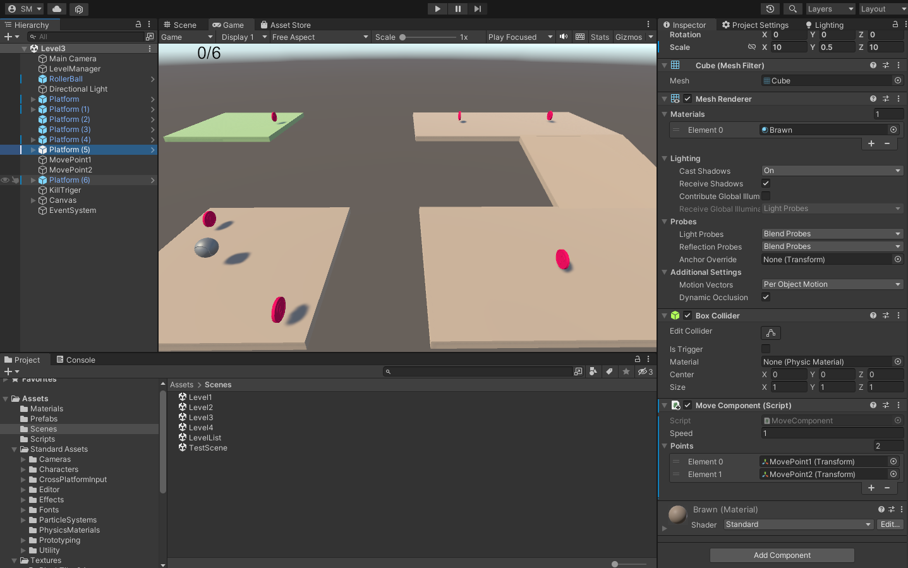
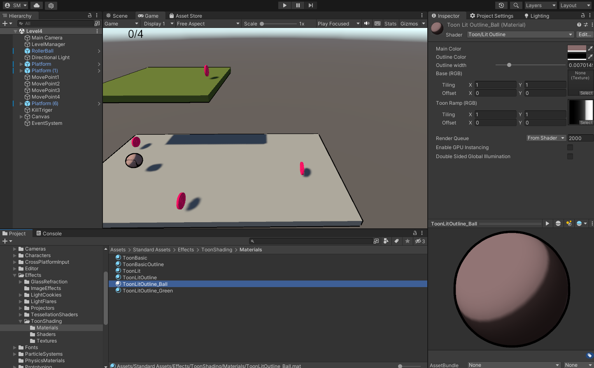

# Labyrinth

## Implemented:
1) Create main logic, Import Standard Assets use roller-ball, import scripts from Dwarf-project
2) Create LookAtComponent for rotate camera logic, use in Level3
3) Rewrite logic MoveComponent for use Array, change settings component for use new logic in Level3, create new scene Level4 with move platform more then two points, add new level in LevelList scene
4) Find textures in internet, create material with new textures, apply in Level2
5) Use Toon-Shader for Level4
6) Create TestScene for test physic, use physic material, create scripts for move object with position-shift and push-shift
7) Create CollisinComponent, use script on scene TestScene

## Unity 2021

